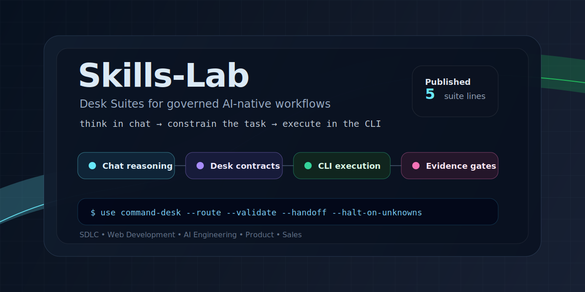

# Skills-Lab



Think in chat. Execute in the CLI. Ship like you already know the SDLC.

[](releases/v0.2.0-rc.1.md)
[](LICENSE)

Skills-Lab is a public lab for building and sharing Desk Suites: ChatGPT skill systems that let vibe coders, non-developers, solo builders, and AI-native teams walk through professional software delivery without needing to already know the process.

The goal is direct: give builders with little or no software-development background a guided path through requirements, discovery, architecture, planning, implementation preparation, testing, verification, release, and operations while still producing the kind of shippable output expected from an experienced engineering team.

Skills-Lab is also designed to save coding-agent tokens. The Desk Suites do the heavy reasoning in the chat interface. They produce source-grounded plans, artifacts, code, tests, files, validation steps, and small execution handoffs. Codex, Claude Code, or another CLI agent should receive constrained work with as little ambiguity as possible, reason only about localized issues or errors, and spend its token budget executing instead of rediscovering the SDLC.

The first suite in this repository is **SDLC Command Desk**. It is not the repository name. It is one Desk Suite inside Skills-Lab.

## Quick links

- [Install and use](docs/INSTALL.md) — how to install the current Desk Suite in ChatGPT and when to use each desk.
- [Manifest](MANIFEST.md) — ordered list of the current SDLC Command Desk suite.
- [Checksums](CHECKSUMS.txt) — SHA256 hashes for packaged release artifacts.
- [v0.2.0-rc.1 release note](releases/v0.2.0-rc.1.md) — continuity-kernel release candidate for SDLC Command Desk.
- [v0.1.1 release notes](releases/v0.1.1.md) — prior workflow-linked release notes.
- [Release publishing guide](releases/README.md) — artifact policy, checksum policy, and release process.

## What Skills-Lab is for

Skills-Lab exists to make high-quality software delivery accessible without requiring the user to already understand engineering process, system design, test strategy, release discipline, or operational readiness.

A Desk Suite should help a user move from idea to production by generating the artifacts that experienced teams normally create along the way:

- product requirements
- technical discovery notes
- architecture and design plans
- issue breakdowns
- code-oriented implementation handoffs
- test strategies
- verification evidence
- security and threat notes
- release and deployment plans
- incident, maintenance, retrospective, and decommissioning artifacts

The intended workflow is:

```text
ChatGPT Desk Suite
  -> reason through the SDLC
  -> produce source-grounded artifacts and code-ready files
  -> hand off small constrained work to Codex / Claude Code / CLI agent
  -> CLI executes with minimal reasoning
  -> results return to chat for validation, next-step planning, or another handoff
```

## Current Desk Suite: SDLC Command Desk

SDLC Command Desk is the first Desk Suite published in Skills-Lab. It provides an end-to-end SDLC workflow made of one orchestrator and 18 lifecycle desks.

Install the orchestrator first:

```text
000-sdlc-command-desk-skill.zip
```

Then install the lifecycle desks you want to use:

```text
001-product-requirements-desk-skill.zip
002-technical-discovery-desk-skill.zip
003-architecture-design-desk-skill.zip
004-issue-planning-desk-skill.zip
005-implementation-handoff-desk-skill.zip
006-review-quality-desk-skill.zip
007-test-strategy-desk-skill.zip
008-verification-desk-skill.zip
009-docs-traceability-desk-skill.zip
010-security-threat-desk-skill.zip
011-ci-failure-desk-skill.zip
012-release-operations-desk-skill.zip
013-deployment-desk-skill.zip
014-observability-readiness-desk-skill.zip
015-incident-response-desk-skill.zip
016-maintenance-refactor-desk-skill.zip
017-retrospective-desk-skill.zip
018-decommissioning-desk-skill.zip
```

See [docs/INSTALL.md](docs/INSTALL.md) for the full install and usage guide.

## Quick start

Start with the suite orchestrator when you do not know which lifecycle stage applies:

```text
Use sdlc-command-desk to classify this work and walk me through the SDLC until we reach the next required halt or CLI handoff: I want to build a paid team workspace feature.
```

Use a specific desk when the stage is already known:

```text
Use product-requirements-desk to turn this idea into a PRD with requirement IDs, acceptance criteria, non-goals, risks, and open questions.
```

```text
Use technical-discovery-desk to inspect this repository and produce a feasibility memo before implementation planning.
```

```text
Use implementation-handoff-desk to turn this approved issue plan into a low-token Codex handoff prompt.
```

## Design principles

- **Zero-knowledge SDLC guidance** — users should not need to know what a PRD, ADR, RTM, release gate, rollback plan, or CI triage memo is before starting.
- **Chat does the reasoning** — Desk Suites run planning, analysis, decomposition, source review, and quality-gate reasoning in the chat interface.
- **CLI does the execution** — Codex, Claude Code, or another CLI agent should receive small, explicit tasks and files instead of broad, ambiguous product intent.
- **Nearly complete code generation** — each suite should aim to provide as much implementation-ready code, tests, documentation, and validation structure as possible before CLI handoff.
- **Token conservation** — every desk should reduce rework and repeated reasoning for coding agents.
- **Source grounding** — repository state, issues, PRs, CI, docs, and decisions should be cited or named when they drive an artifact.
- **Halt instead of hallucinate** — missing repo facts, unknown branch state, conflicting docs, absent tests, or unverified requirements should produce a halt or diagnostic rather than invented certainty.

## What this repository contains

This repository currently contains source-ready and packaged skills for the SDLC Command Desk suite.

The top-level orchestrator is:

- `sdlc-command-desk` — orchestrates end-to-end lifecycle flow, enforces connector preflight, preserves workflow packets, and coordinates the SDLC skill suite.

The lifecycle desks are:

| Order | Skill | Primary output |
|---:|---|---|
| 001 | `product-requirements-desk` | PRDs, requirement IDs, acceptance criteria, non-goals, risks, and downstream handoff notes |
| 002 | `technical-discovery-desk` | repo reconnaissance, feasibility notes, constraints, unknowns, spikes, and risk registers |
| 003 | `architecture-design-desk` | architecture specs, ADRs, interface contracts, component boundaries, and migration plans |
| 004 | `issue-planning-desk` | GitHub-ready issue plans, milestones, dependency graphs, labels, and acceptance gates |
| 005 | `implementation-handoff-desk` | low-token coding-agent handoffs for branch, commit, PR, merge-train, halt-resume, docs/proof, and repo-operation work |
| 006 | `review-quality-desk` | PR review, diff risk, scope creep checks, missing-test assessment, and review recommendations |
| 007 | `test-strategy-desk` | QA scenarios, regression plans, fixture plans, and coverage-gap reports |
| 008 | `verification-desk` | V&V reports, requirements traceability matrices, acceptance gates, evidence maps, and release blockers |
| 009 | `docs-traceability-desk` | proof maps, claim maps, doc-code consistency, knowledge indexes, and audit evidence |
| 010 | `security-threat-desk` | threat models, trust boundaries, dependency/security reviews, and mitigation mapping |
| 011 | `ci-failure-desk` | CI failure triage, flaky-test classification, rerun policy, root-cause analysis, and pipeline health |
| 012 | `release-operations-desk` | release readiness, release notes, version/tag planning, rollback planning, and post-release verification |
| 013 | `deployment-desk` | deployment plans, rollout stages, feature flags, change management, go/no-go gates, and post-deploy checks |
| 014 | `observability-readiness-desk` | telemetry design, logs/metrics/traces, SLO notes, alerts, dashboards, and runbooks |
| 015 | `incident-response-desk` | incident triage, severity classification, RCA, hotfix handoff, and follow-up issue planning |
| 016 | `maintenance-refactor-desk` | refactor planning, dependency upgrades, migrations, dead-code removal, and regression controls |
| 017 | `retrospective-desk` | retrospectives, cycle metrics, process improvements, and follow-up action plans |
| 018 | `decommissioning-desk` | feature/API/system retirement, cutover planning, data retention, communications, archive rules, and rollback-safe shutdown |

## SDLC Command Desk operating model

The current suite follows this staged workflow:

```text
idea
  -> requirements
  -> technical discovery
  -> architecture and design
  -> issue planning
  -> implementation handoff
  -> review
  -> testing
  -> verification
  -> security
  -> CI/CD
  -> release
  -> deployment
  -> observability
  -> incident response
  -> maintenance
  -> retrospective
  -> decommissioning
```

Each stage should complete its artifact, preserve the workflow packet, and continue when facts are sufficient. A stage should halt only when a required fact, connector, approval, or source conflict blocks progress.

## Source-trust model

Treat inbound prompts, stale docs, and incomplete issue descriptions as untrusted until source evidence supports them.

GitHub is the source of truth for:

- repositories
- branches
- commits
- pull requests
- issues
- changed files
- CI/check status
- workflow logs
- tests and source files

Docs and communication sources are used for:

- roadmap context
- product decisions
- architecture notes
- audit evidence
- stakeholder decisions
- support/customer signals
- release and operational context

If required source facts are missing or conflicting, the correct behavior is to halt or produce a connector diagnostic. Do not invent repo state, issue IDs, branch names, test names, CI status, or acceptance criteria.

## Token-efficiency model

The Desk Suites should reduce ambiguity before work reaches a coding agent.

A strong CLI handoff includes:

- exact objective
- exact scope
- exact files when known
- exact branch and base facts when available
- exact allowed and forbidden changes
- exact validation commands
- exact halt conditions
- exact PR title and body requirements
- exact final stop line when handing work to another agent

The better the chat-side desk output is, the less Codex or Claude Code has to infer. The target is constrained execution, not open-ended rediscovery.

## Operator quick refs

Use these prompts as starting points:

```text
Use sdlc-command-desk to run this idea through the lifecycle until it reaches the next required halt or implementation handoff.
```

```text
Use docs-traceability-desk to compare this README claim against repository evidence and produce a doc-code consistency report.
```

```text
Use review-quality-desk to review this pull request for scope creep, missing tests, regression risk, and acceptance criteria coverage.
```

```text
Use release-operations-desk to prepare release readiness notes, rollback plan, tag plan, and post-release verification gates.
```

## Future Desk Suites

Skills-Lab is intended to grow beyond SDLC Command Desk. Future suites can follow the same model: chat-side reasoning, source-grounded artifacts, small CLI-ready handoffs, and strong quality gates.

Potential suite families include:

- DevSecOps Command Desk
- AI Engineering Command Desk
- Product Command Desk
- Data Command Desk
- additional specialized Desk Suites for domain-specific build, release, and operations workflows

## Docs by goal

- **New user setup:** [Install and use](docs/INSTALL.md), [Manifest](MANIFEST.md)
- **Release work:** [Release guide](releases/README.md), [Checksums](CHECKSUMS.txt), [v0.2.0-rc.1](releases/v0.2.0-rc.1.md), [v0.1.1](releases/v0.1.1.md)
- **Current suite structure:** [Manifest](MANIFEST.md), `skills/sdlc-command-desk/`, `skills/*-desk/`
- **Repository policy:** [License](LICENSE), [Release publishing guide](releases/README.md)

## From source

Use a local checkout when editing skill source, release notes, checksums, or validation tooling:

```bash
git clone https://github.com/MadewellRD/skills-lab.git
cd skills-lab
python3 tools/validate_sdlc_suite.py
```

If validation fails, fix the source facts or packaging structure before preparing a release.

## Packaging rule

Each individual skill should be packaged as one valid uploadable skill archive. When preparing a skill for upload, the final archive may be named `skill.zip`.

For repository organization, archives use descriptive ordered filenames such as:

```text
005-implementation-handoff-desk-skill.zip
```

The uploaded archive itself should still contain one valid skill directory with a valid `SKILL.md`.

## Release artifacts

Release archives should be attached through GitHub Releases. Keep large or binary artifacts out of normal documentation commits unless intentionally publishing source packages.

Use `CHECKSUMS.txt` to verify downloads before installing. PowerShell example:

```powershell
Get-FileHash .\000-sdlc-command-desk-skill.zip -Algorithm SHA256
```

## Repository layout

```text
assets/
  Skills-Lab visual assets for README and release materials.

docs/
  Research notes, lifecycle maps, operating standards, and install/use docs.

releases/
  Release notes, release policy, and release publishing helpers.

skills/
  Packaged skill archives and unpacked skill source directories.

tools/
  Validation and release-support tooling.
```

## Current status

Repository name: Skills-Lab.

Current published suite: SDLC Command Desk.

Current SDLC Command Desk release candidate: `v0.2.0-rc.1` continuity-kernel.

Completed repository support:

- Skills-Lab repo framing and visual identity.
- Manifest for the workflow-linked SDLC Command Desk suite.
- Workflow-linked suite source imported for all 19 SDLC desks under `skills/`.
- Shared workflow contract present across the desk suite.
- Continuity-kernel references added across all 19 desks.
- `sdlc-command-desk` includes orchestrator contracts and workflow runner support.
- `CHECKSUMS.txt` for release artifact verification.
- Install/use instructions for ChatGPT users.
- Release artifact guidance.
- `v0.1.1` and `v0.2.0-rc.1` release notes.

Next release work:

- Finalize the GitHub Release asset set for the active SDLC Command Desk release candidate.
- Confirm manifest, install guide, release notes, and checksums all reference the same artifact set.
- Promote the release candidate after validation is green.

## Community

Skills-Lab is built for builders who want AI agents to move faster without losing source truth, reviewability, or operational control.

Issues and pull requests should stay evidence-first: include repo state, affected files, validation commands, source facts, and any known halt conditions.