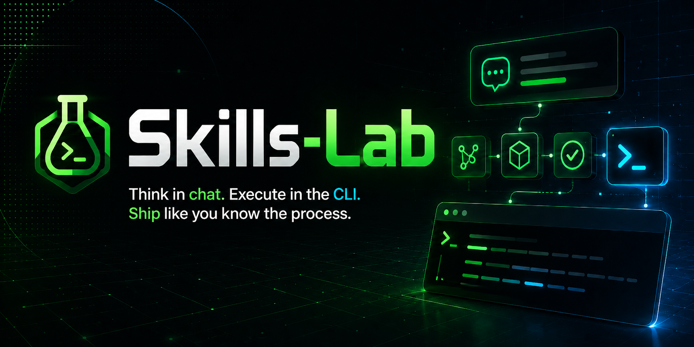

# Skills-Lab

<p align="center">
  
</p>

<p align="center">
  <a href="https://github.com/MadewellRD/skills-lab/releases/latest"></a>
  <a href="MANIFEST.md"></a>
  <a href="MANIFEST.md"></a>
  <a href="profiles/"></a>
  <a href="profiles/frontier-2026-07.yaml"></a>
  <a href="docs/model-upgrade-playbook.md"></a>
  <a href="profiles/frontier-2026-07.yaml#L60"></a>
  <a href="LICENSE"></a>
</p>

<p align="center"><strong>Think in chat. Execute in the CLI. Ship like you already know the process.</strong></p>

<p align="center">
  Skills-Lab is a public lab for building and sharing <strong>Desk Suites</strong>: agent skill systems that let vibe coders, non-developers, solo builders, and AI-native teams walk professional workflows without needing to already know the process.
</p>

<p align="center">
  Give builders a guided path through any domain, whether software delivery, web development, AI engineering, product, sales, or mobile, while producing the kind of output expected from an experienced team. Chat does the reasoning. The CLI does the execution. Coding agents receive constrained, source-grounded work instead of open-ended intent.
</p>

---

## What makes this different

Most skill libraries are written against whatever model existed the day they were authored, and they quietly rot as models improve. Skills-Lab treats model capability as **versioned configuration**, not as prose baked into 385 files.

Every assumption about the executing model lives in one file, `profiles/frontier-2026-07.yaml`. A new frontier model release is a config change and a rebuild:

```bash
$EDITOR profiles/frontier-2026-07.yaml
for v in generic anthropic openai google; do python3 tools/build_skills.py --vendor $v; done
python3 tools/audit_skills.py
```

That propagates to all 385 skills across 21 suites and 4 vendor targets. Nothing is hand-edited. See [the model upgrade playbook](docs/model-upgrade-playbook.md).

**Authored at the frontier, deliberately.** Every skill here is written and upgraded using the most capable frontier model available at the time, run at its highest reasoning effort. That is policy in `authoring_standard`, not an implicit habit. The asymmetry is the reason: authoring happens once per release, execution happens on every invocation forever, and prose written at a reduced tier reads as correct while quietly leaving the ambiguity in place. Each release records the model and effort tier that produced it, with effort attested by the maintainer rather than self-reported by the authoring run.

**Authored across vendors, not just built for them.** Passes on more than one vendor's frontier model are scheduled. This is a stronger test than token substitution: substitution proves the output names no vendor, while multi-vendor authoring probes whether the corpus has one vendor's house style baked into its structure, which no find-and-replace would surface. Where two frontier models disagree about how a desk should be written, the disagreement marks an ambiguous instruction rather than a wrong model, and the fix goes into the instruction so the next pass produces it everywhere.

**Vendor agnostic by construction.** Skill sources contain no vendor names. They use `{{AGENT}}` and `{{CODING_AGENT}}` tokens that resolve at build time from `profiles/vendors/<vendor>.yaml`. The default build mentions no vendor at all. Adding a vendor is one file and zero skill edits, and the audit fails if a vendor name leaks into a skill body.

---

## Release status

**v1.1.0** adds fourteen suites: security, platform engineering, reliability, cloud, data, governance, privacy, legal, finance, and the commercial functions. 385 skills across 21 suites, every one built from the same capability profile and vendor-neutral by construction.

| Suite | Skills | Release tag | Packages |
|---|---:|---|---|
| [Cloud Infrastructure Command Desk](releases/cloud-infrastructure-command-desk-v1.1.0.md) | 20 | `cloud-infrastructure-command-desk-v1.1.0` | `dist/packages/cloud-infrastructure-command-desk/` |
| [Customer Success Command Desk](releases/customer-success-command-desk-v1.1.0.md) | 20 | `customer-success-command-desk-v1.1.0` | `dist/packages/customer-success-command-desk/` |
| [Data Command Desk](releases/data-command-desk-v1.1.0.md) | 20 | `data-command-desk-v1.1.0` | `dist/packages/data-command-desk/` |
| [FinOps Command Desk](releases/finops-command-desk-v1.1.0.md) | 20 | `finops-command-desk-v1.1.0` | `dist/packages/finops-command-desk/` |
| [Finance Accounting Command Desk](releases/finance-accounting-command-desk-v1.1.0.md) | 20 | `finance-accounting-command-desk-v1.1.0` | `dist/packages/finance-accounting-command-desk/` |
| [Legal Contracts Command Desk](releases/legal-contracts-command-desk-v1.1.0.md) | 20 | `legal-contracts-command-desk-v1.1.0` | `dist/packages/legal-contracts-command-desk/` |
| [People Talent Command Desk](releases/people-talent-command-desk-v1.1.0.md) | 20 | `people-talent-command-desk-v1.1.0` | `dist/packages/people-talent-command-desk/` |
| [Platform Engineering Command Desk](releases/platform-engineering-command-desk-v1.1.0.md) | 20 | `platform-engineering-command-desk-v1.1.0` | `dist/packages/platform-engineering-command-desk/` |
| [SDLC Command Desk](releases/sdlc-command-desk-v1.1.0.md) | 20 | `sdlc-command-desk-v1.1.0` | `dist/packages/sdlc-command-desk/` |
| [SRE Reliability Command Desk](releases/sre-reliability-command-desk-v1.1.0.md) | 20 | `sre-reliability-command-desk-v1.1.0` | `dist/packages/sre-reliability-command-desk/` |
| [Security Command Desk](releases/security-command-desk-v1.1.0.md) | 20 | `security-command-desk-v1.1.0` | `dist/packages/security-command-desk/` |
| [Customer Support Command Desk](releases/customer-support-command-desk-v1.1.0.md) | 19 | `customer-support-command-desk-v1.1.0` | `dist/packages/customer-support-command-desk/` |
| [GRC Command Desk](releases/grc-command-desk-v1.1.0.md) | 19 | `grc-command-desk-v1.1.0` | `dist/packages/grc-command-desk/` |
| [Privacy Data Protection Command Desk](releases/privacy-data-protection-command-desk-v1.1.0.md) | 19 | `privacy-data-protection-command-desk-v1.1.0` | `dist/packages/privacy-data-protection-command-desk/` |
| [Procurement Vendor Management Command Desk](releases/procurement-vendor-management-command-desk-v1.1.0.md) | 19 | `procurement-vendor-management-command-desk-v1.1.0` | `dist/packages/procurement-vendor-management-command-desk/` |
| [AI Engineering Command Desk](releases/ai-engineering-command-desk-v1.1.0.md) | 18 | `ai-engineering-command-desk-v1.1.0` | `dist/packages/ai-engineering-command-desk/` |
| [Product Command Desk](releases/product-command-desk-v1.1.0.md) | 16 | `product-command-desk-v1.1.0` | `dist/packages/product-command-desk/` |
| [Android Command Desk](releases/android-command-desk-v1.1.0.md) | 14 | `android-command-desk-v1.1.0` | `dist/packages/android-command-desk/` |
| [Web Development Command Desk](releases/web-development-command-desk-v1.1.0.md) | 14 | `web-development-command-desk-v1.1.0` | `dist/packages/web-development-command-desk/` |
| [iOS Command Desk](releases/ios-command-desk-v1.1.0.md) | 14 | `ios-command-desk-v1.1.0` | `dist/packages/ios-command-desk/` |
| [Sales Command Desk](releases/sales-command-desk-v1.1.0.md) | 13 | `sales-command-desk-v1.1.0` | `dist/packages/sales-command-desk/` |

Archives are deterministic. The same source produces byte-identical zips, so a checksum mismatch means the content actually changed.

```bash
python3 tools/validate_release_assets.py
```

**Source scaffold suites**, directories with no packaged skills yet: Knowledge Ops, Marketing Growth, Research.

---

## How Desk Suites work

```text
Desk Suite in chat
  -> reason through the workflow domain
  -> produce source-grounded artifacts, plans, and code-ready files
  -> hand off constrained work to a coding agent
  -> the agent executes against an unambiguous spec
  -> results return to chat for validation and next-step planning
```

**Chat does the reasoning.** Desk Suites run planning, analysis, decomposition, source review, and quality-gate reasoning in the chat interface.

**The CLI does the execution.** Coding agents receive explicit scope and files, not broad product intent. The goal is constrained execution, not open-ended rediscovery.

**Halt instead of hallucinate.** Halts are reserved for six consequence classes: approval, production or destructive action, security or privacy, source conflict, release integrity, and unreachable evidence. Everything else proceeds with the assumption labeled inline, because a halt a competent human would have worked through is a defect, not a safeguard.

---

## Quick start

Install a suite from a [GitHub Release](https://github.com/MadewellRD/skills-lab/releases), or build from source. Then start with a suite orchestrator when you do not know which stage applies:

```text
Use sdlc-command-desk to classify this work and walk me through the lifecycle:
I want to build a paid team workspace feature.
```

Use a specific desk when the stage is known:

```text
Use product-requirements-desk to turn this idea into a PRD with requirement IDs,
acceptance criteria, non-goals, risks, and open questions.
```

```text
Use implementation-handoff-desk to turn this approved issue plan into a
coding-agent handoff prompt.
```

```text
Use goliveprompt to scan this repo end to end, audit it against every suite,
split the work into sprints, and give me a live tracker.
```

```text
Use android-command-desk to plan, build, validate, and release an Android
app or game without skipping platform-specific gates.
```

---

## Design principles

- **Zero-knowledge domain guidance.** Users should not need to know what a PRD, ADR, RTM, MEDDICC score, inference SLO, or release gate is before starting.
- **Source grounding.** Repo state, issues, PRs, CI, docs, CRM, and connector evidence are cited when they drive an artifact.
- **Handoff density, not brevity.** A handoff is judged on whether it removes ambiguity, not on how short it is. Context is no longer scarce; ambiguity is the constraint.
- **Complete artifact sets.** A run delivers the set of artifacts the stage owes, not a menu to pick one from. This never licenses inventing an artifact that has no source basis.
- **Workflow continuity.** Desks preserve workflow packets so sessions pause, resume, and hand off without losing state.
- **Governance does not scale down.** Never invent facts, separate fact from assumption, preserve conflicts, respect approval gates. Capability raises the fluency of a wrong answer as fast as the accuracy of a right one, so these hold regardless of how good the model gets.

---

## Repository layout

```text
profiles/                       Capability profile and vendor adapters.
  frontier-2026-07.yaml         What the executing model may be assumed to do.
  vendors/<vendor>.yaml         Token map per vendor. Adding a vendor is one file.

kernel/
  references/                   Tier 1. Shared defaults inherited by every skill.

skills/
  <Command Desk Suite>/
    <desk>.md                   Skill body. Uses {{TOKENS}}, never vendor names.
    references/                 Tier 2. Suite-level overrides.
    _skills/<skill-slug>/
      skill.yaml                Interface metadata, vendor-neutral.
      references/               Tier 3. Skill-level overrides.
      scripts/  assets/

dist/
  skills/                       Generated vendor-neutral build.
  vendor/<vendor>/              Generated per-vendor builds.
  packages/                     Deterministic ZIP archives per suite.
  manifests/                    Generated manifests and checksums.

tools/
  build_skills.py               Source cascade plus profile, into dist.
  audit_skills.py               Drift, capability debt, vendor leakage, house style.
  cut_release.py                Package, checksum, and write release notes.
  validate_release_assets.py    Verify checksums against packages.
  validate_sdlc_suite.py        Suite-level structural checks.

docs/
  model-upgrade-playbook.md     How to upgrade every skill on a model release.
  skills-repo-structure.md      Authoring layout and resolution rules.
  INSTALL.md                    How to install a Desk Suite.

releases/                       Versioned release notes and publish scripts.
```

Reference resolution is most-specific-wins: skill, then suite, then kernel. A file is stored once and fanned out by the build, which is why the source tree produces over 1,500 packaged reference files with no duplication to maintain.

---

## Build from source

```bash
git clone https://github.com/MadewellRD/skills-lab.git
cd skills-lab

# build every vendor target
for v in generic anthropic openai google; do python3 tools/build_skills.py --vendor $v; done

# verify
python3 tools/audit_skills.py
python3 tools/validate_sdlc_suite.py
python3 tools/validate_release_assets.py
```

`tools/audit_skills.py` gates on broken citations, unresolved tokens, vendor leakage, capability debt, duplication, and house style. It is the check to run after any profile change.

---

## Contributing

See [CONTRIBUTING.md](CONTRIBUTING.md). Two rules matter most:

1. **Never hand-edit `dist/`.** It is generated. Edit source and rebuild.
2. **Never hardcode a vendor name in a skill body.** Use `{{AGENT}}` or `{{CODING_AGENT}}`. The audit fails otherwise.

Adding a skill needs only a body plus `skill.yaml`. Shared references are inherited from the kernel automatically, and the build injects the active capability baseline, so a new skill adopts the current profile with no action required.

---

## License

[AGPL-3.0-only](LICENSE).
